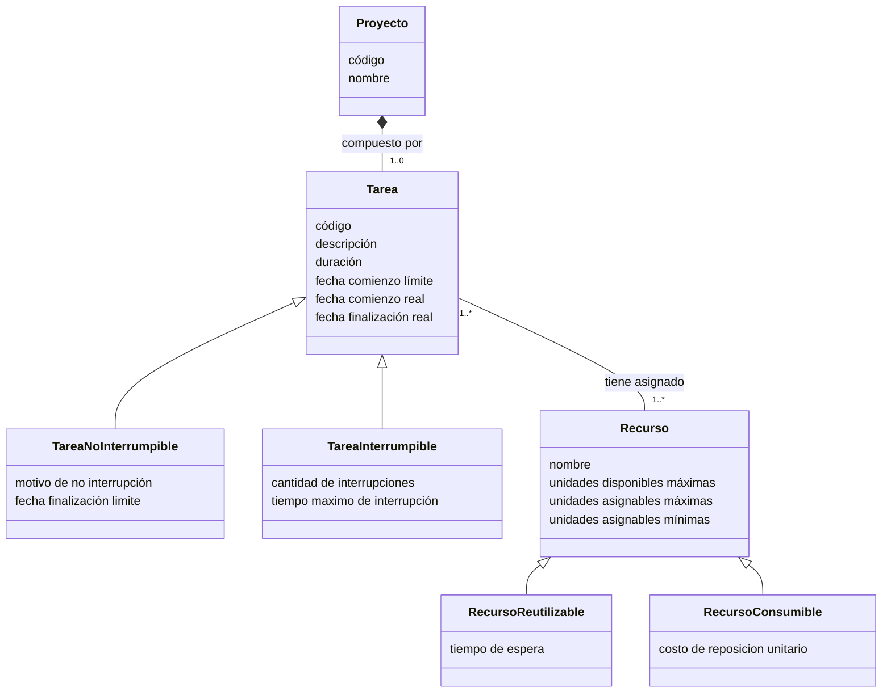
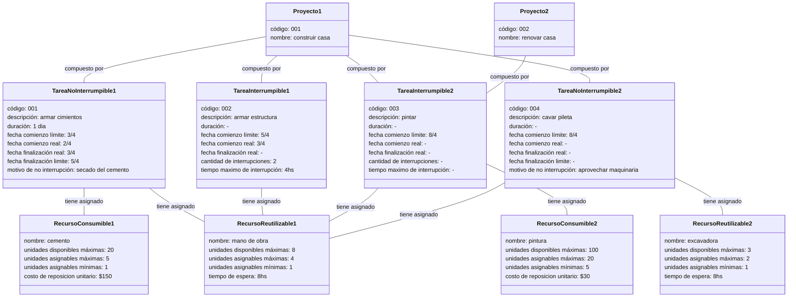

### Modelo de Dominio

```mermaid
classDiagram

  class Proyecto {
    código
    nombre
  }

  class Tarea {
    código
    descripción
    duración
    fecha comienzo límite
    fecha comienzo real
    fecha finalización real
  }

  class Tarea No Interrumpible {
    motivo de no interrupción
    fecha finalización limite
  }

  class Tarea Interrumpible {
    cantidad de interrupciones
    tiempo maximo de interrupción
  }

  class Recurso {
    nombre
    unidades disponibles máximas
    unidades asignables máximas
    unidades asignables mínimas
  }

  class Recurso Reutilizable {
    tiempo de espera
  }

  class Recurso Consumible {
    costo de reposicion unitario
  }

  Proyecto *--"1..0" Tarea : compuesto por

  Tarea <|-- Tarea No Interrumpible
  Tarea <|-- Tarea Interrumpible

  Tarea "1..*"--"1..*" Recurso : tiene asignado

  Recurso <|-- Recurso Reutilizable
  Recurso <|-- Recurso Consumible

```

#### Instanciacion

```mermaid
classDiagram

  class Proyecto 1 {
    código: 001
    nombre: construir casa
  }

  class Proyecto 2 {
    código: 002
    nombre: renovar casa
  }

  class Tarea No Interrumpible 1 {
    código: 001
    descripción: armar cimientos
    duración: 1 dia
    fecha comienzo límite: 3/4
    fecha comienzo real: 2/4
    fecha finalización real: 3/4
    fecha finalización limite: 5/4
    motivo de no interrupción: secado del cemento
  }

  class Tarea Interrumpible 1 {
    código: 002
    descripción: armar estructura
    duración: -
    fecha comienzo límite: 5/4
    fecha comienzo real: 3/4
    fecha finalización real: -
    cantidad de interrupciones: 2
    tiempo maximo de interrupción: 4hs
  }

  class Tarea Interrumpible 2 {
    código: 003
    descripción: pintar
    duración: -
    fecha comienzo límite: 8/4
    fecha comienzo real: -
    fecha finalización real: -
    cantidad de interrupciones: -
    tiempo maximo de interrupción: -
  }

  class Tarea No Interrumpible 2 {
    código: 004
    descripción: cavar pileta
    duración: -
    fecha comienzo límite: 8/4
    fecha comienzo real: -
    fecha finalización real: -
    fecha finalización limite: -
    motivo de no interrupción: aprovechar maquinaria
  }

  class Recurso Consumible 1{
    nombre: cemento
    unidades disponibles máximas: 20
    unidades asignables máximas: 5
    unidades asignables mínimas: 1
    costo de reposicion unitario: $150
  }
  class Recurso Consumible 2{
    nombre: pintura
    unidades disponibles máximas: 100
    unidades asignables máximas: 20
    unidades asignables mínimas: 5
    costo de reposicion unitario: $30
  }

  class Recurso Reutilizable 1 {
    nombre: mano de obra
    unidades disponibles máximas: 8
    unidades asignables máximas: 4
    unidades asignables mínimas: 1
    tiempo de espera: 8hs
  }

  class Recurso Reutilizable 2 {
    nombre: excavadora
    unidades disponibles máximas: 3
    unidades asignables máximas: 2
    unidades asignables mínimas: 1
    tiempo de espera: 8hs
  }

  Proyecto1 -- Tarea No Interrumpible 1 : compuesto por
  Proyecto1 -- Tarea Interrumpible 1 : compuesto por
  Proyecto1 -- Tarea Interrumpible 2 : compuesto por
  Proyecto1 -- Tarea No Interrumpible 2 : compuesto por
  Proyecto2 -- Tarea Interrumpible 2 : compuesto por

  Tarea No Interrumpible 1 -- Recurso Consumible 1 : tiene asignado
  Tarea Interrumpible 2 -- Recurso Consumible 2 : tiene asignado

  Tarea No Interrumpible 1 -- Recurso Reutilizable 1 : tiene asignado
  Tarea Interrumpible 1 -- Recurso Reutilizable 1 : tiene asignado
  Tarea Interrumpible 2 -- Recurso Reutilizable 1 : tiene asignado
  Tarea No Interrumpible 2 -- Recurso Reutilizable 1 : tiene asignado

  Tarea No Interrumpible 2 -- Recurso Reutilizable 2 : tiene asignado

```
