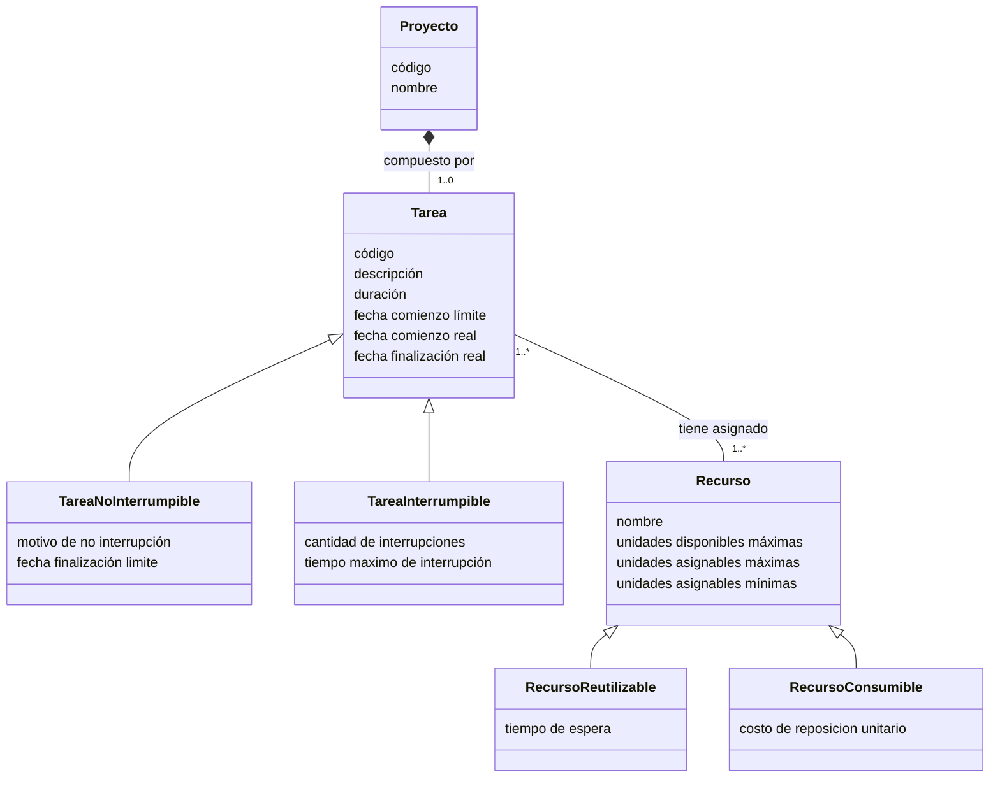
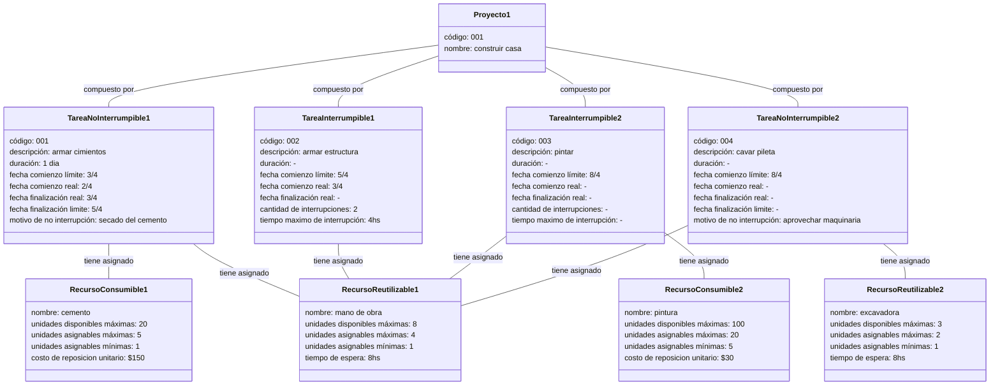

### Actividad 4.6

#### Enunciado

Desarrollar el modelo de dominio para el siguiente escenario:

- Cada proyecto posee nombre y código.
- Un proyecto se compone de tareas. Cada tarea tiene un código identificador, una descripción textual, duración en horas, fechas límite y real de comienzo, y fecha real de finalización.
- Las tareas pueden ser interrumpibles o no interrumpibles, por ello se requiere también conocer su estado. Para cada tarea no interrumpible interesa conocer el motivo por el cual no puede ser interrumpida y la fecha límite de finalización.
- Las tareas interrumpibles no tienen fecha límite de finalización y para cada una de estas interesa conocer la cantidad de veces que fue interrumpida y el tiempo máximo de interrupción.
- Las tareas tienen asignados recursos. Una tarea puede tener varios recursos asignados y un recurso puede estar asignado a muchas tareas.
- Un recurso tiene un nombre, la cantidad máxima de unidades disponibles y las cantidades mínimas y máximas que pueden asignarse a una tarea cualquiera. Cuando un recurso es asignado a una tarea (en cierta cantidad de unidades) será utilizado durante todo el período de tiempo en que dura la tarea.
- Los recursos pueden ser reutilizables o consumibles. Para los reutilizables se conoce la cantidad de unidades de tiempo que debe permanecer inutilizado el recurso luego de ser liberado para ser asignado a otra tarea. Para los consumibles interesa saber el costo de reposición de cada unidad del recurso.

Para cada una de las entidades del modelo de domino desarrolle ejemplos de al menos dos instancias que validen el modelo desarrollado. Se puede utilizar el diagrama de objetos de UML (https://en.wikipedia.org/wiki/Object_diagram).

#### Modelo de Dominio

#### Instanciacion

#### Correcciones

Nota: 55/100

##### Correcciones Generales

Si la actividad está incompleta, por ejemplo no se desarrollaron las instancias o es evidente que el modelo es parcial, se considera desaprobada (nota menor a 40).

La primera clave del modelo pasa por modelar la cantidad de recursos utilizados en una tarea. Este atributo es propio de la relación (Asignación) entre las entidades Tarea y Recurso y no propia del Recurso. Modelar que al momento de asignación de unidades a una tarea, se modifican los valores de máximos y mínimos disponibles es pensar ya en la implementación y se pierde la posibilidad de “recordar” la cantidad de unidades asignadas de Recursos a una Tarea. Como ya indicamos en clase este requisito se modela con una entidad asociativa.

El estado de una Tarea también es algo que varias personas no modelaron. Lo explicamos en clase.

Es muy importante que se respete la notación del MDD. Algunos ejemplos de errores:

- Es conveniente modelar las entidades en singular
- Modelar la misma asociación 2 veces. En este caso alcanza con una sola línea y se puede indicar arriba y abajo la lectura de la asociación indicando los sentidos.
- Asociaciones con flecha sin ser relaciones de especialización-generalización.
- No corresponden indicadores de acceso de atributos (signo “+”, signo “-” delante de cada atributo)
- Confundir rombo lleno y vacío (el primero indica composición, el segundo agregación)
- No se deben indicar atributos que referencien otra entidad (eso es implementación, las asociaciones son la herramienta para esto)
- Faltan indicar cardinalidades en los extremos de asociaciones
- Falta indicar nombre asociación y/o sentido de lectura
- No se indica si la cardinalidad es 0 ó 1 a muchos (sólo se indica el “\*”)
- No se indica con el signo “/” los atributos calculados

Como indicamos en el taller del lunes pasado no deberían existir en el modelo entidades sin atributos y las entidades deberían tener un atributo identificador.

Otros ajustes y mejoras al modelar son:

- Faltan atributos (muy común el caso de fecha estimada y real de comienzo, son 2 atributos diferentes)
- Se cambiaron de nombre atributos (Ej: Costo y Precio no son lo mismo en este contexto).
- Entidades como DescripciónTarea, DescripciónRecurso, TipoRecurso, TipoTarea son indicios de pensar en implementación. Sus atributos son propios de la entidad que representan
- Una Tarea puede no tener recursos asignados

Recuerden que pueden agregar pequeñas notas aclaratorias al modelo.

Los ejemplos de instanciación tienen que ser con datos lo más cercanos a la realidad. “Proyecto01" o “Tarea02” no lo son.

Algo importante es que el modelo sea “legible”. Es un modelo pequeño pero piensen en modelos con decenas de entidades y cientos de asociaciones. Por eso es importante los tamaños y las ubicaciones de las entidades de forma de evitar cruces de líneas o sentidos de lectura confusos (por ejemplo las relaciones de especialización-generalización conviene ubicar la entidad general por encima).

Ejemplos de instanciación:

- Proyecto pintar una habitación. Pintar (No interrumpible), Lijar (Interrumpible), Pintura (Consumible), Lija (Consumible), Rodillo (Reutilizable)
- Proyecto contrucción casa: Encofrado (No interrumpible), Albaliñería paredes (Interrumpible), Cemento (Consumible), Ladrillo (Consumible), Mezcladora (Reutilizable)
